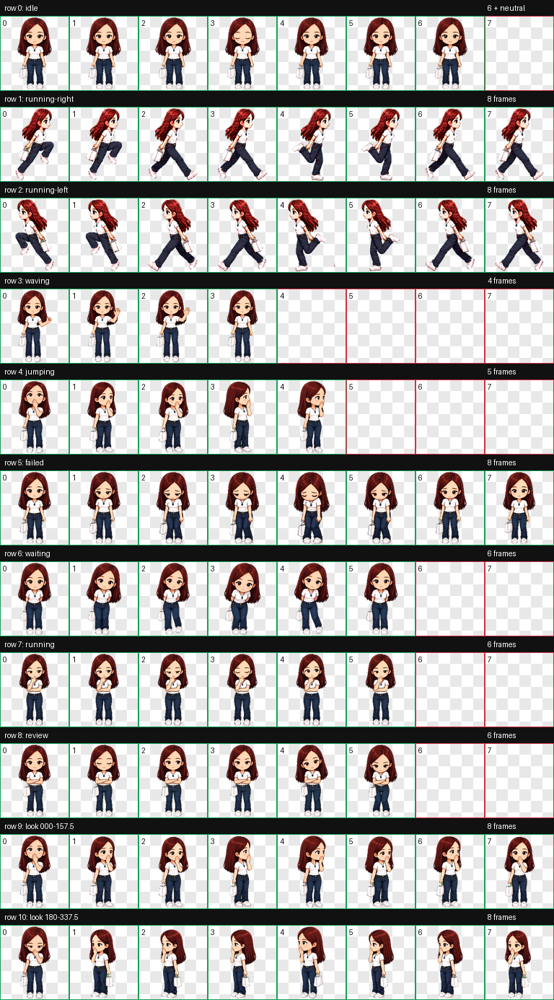

# 堃堃 · Codex Q版像素宠物

“堃堃”是一只根据人物外形制作的 Codex v2 动画宠物：披肩直发、白色运动鞋、白色手提包，待机时保持正面。



## 动画内容

- 正面待机、左右移动、挥手与跳跃
- 失败、等待、执行任务和审阅状态
- 16 个环视方向
- `8 × 11` v2 图集，单格尺寸为 `192 × 208`

## Windows 一键安装

克隆仓库后，在 PowerShell 中执行：

```powershell
Set-ExecutionPolicy -Scope Process Bypass
.\install.ps1
```

脚本会把宠物安装到：

```text
%USERPROFILE%\.codex\pets\kunkun
```

安装后需要从系统托盘彻底退出 Codex，再重新启动并选择“堃堃”。仅关闭窗口不会终止后台进程，也不会重新加载宠物图集。

## 手动安装

将 `kunkun` 文件夹完整复制到：

```text
C:\Users\<你的用户名>\.codex\pets\kunkun
```

文件结构：

```text
kunkun/
├── pet.json
└── spritesheet.webp
```

## 验证结果

- `spriteVersionNumber`: `2`
- 图集尺寸：`1536 × 2288`
- 格式：透明 `RGBA WebP`
- 结构验证：通过，无错误、无警告

仓库不包含制作时使用的原始照片、视频或生成缓存。
